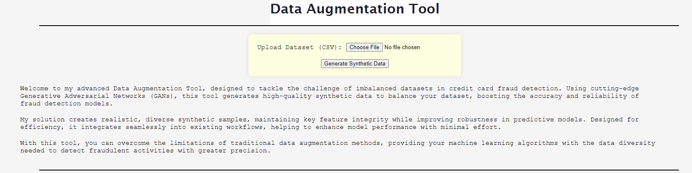

# Generative AI Data Augmentation Tool for Credit Card Fraud Detection
This repository contains a data augmentation tool that utilizes a Generative Adversarial Network (GAN) to synthesize tabular data, specifically tailored for the detection of credit card fraud. The primary goal of this project is to tackle the issue of class imbalance in fraud detection datasets by generating realistic synthetic data, improving the robustness of predictive models.

## Features
* Generative Adversarial Network (GAN): A GAN trained to generate synthetic credit card transaction data while preserving critical patterns.
* Data Augmentation: This tool generates additional fraud and non-fraud samples, balancing the dataset and improving model performance.
* Flask Web Application: The app provides a user-friendly interface for generating synthetic data and integrating it with existing datasets.
* Containerized Deployment: Dockerized for easy deployment on cloud platforms or local environments.

## Project Structure
* src/: Contains the source code for the GAN, the Flask web app, and utility scripts.
* models/: Pre-trained models and saved GAN checkpoints.
* static/: Contains the HTML, CSS, and JavaScript files for the web interface.
* Dockerfile: Configuration for containerizing the application.
* requirements_docker.txt: Dependencies required to run the project.
* notebooks/: Contains the workflow for training the model.

## Usage
Once the web app is running:

* Upload your dataset (preferably a fraud detection dataset).
* Generate synthetic data to augment your original dataset.
* Download the enhanced dataset and use it for training your machine learning models.

## GAN Model
The GAN model is designed to generate tabular data, with special attention paid to constraints in the dataset. For example, specific features like Amount are constrained to be positive to ensure the data remains realistic. The model was trained using this [Kaggle dataset](https://www.kaggle.com/datasets/nelgiriyewithana/credit-card-fraud-detection-dataset-2023).

## Performance
This tool has been tested with credit card fraud detection datasets and successfully increases model performance, especially in handling imbalanced datasets. Metrics such as accuracy, precision, recall, and F1-score have been used to validate the impact of the augmented data.

After the last epoch the metrics yielded:
* Accuracy: 0.9493
* Precision: 0.9272
* Recall: 0.9768
* F1-score: 0.9505

## Notebooks
In the notebooks you can find:
* Data analysis: Review of dataset and intentional imbalance.
* Data processing: Data processing and training of model.
* Pipeline test: A mock run of how the tool performs step by step.
* Machine Learning Workflow: An example of how the tool could be added to a Machine Learning Worflow.

## Interface

